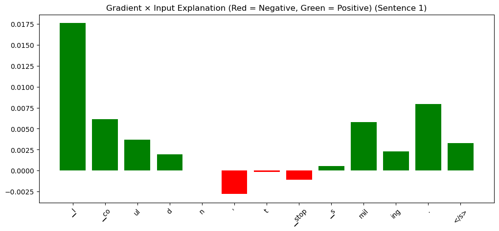
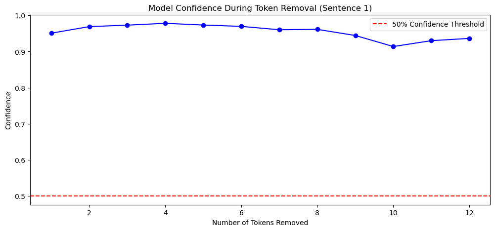
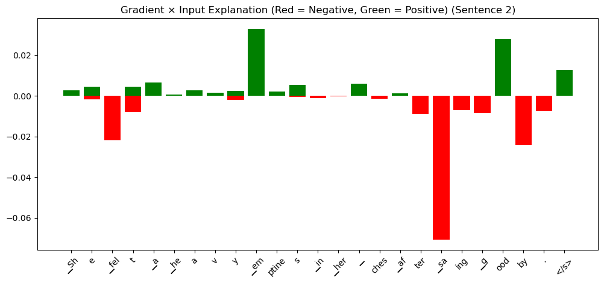
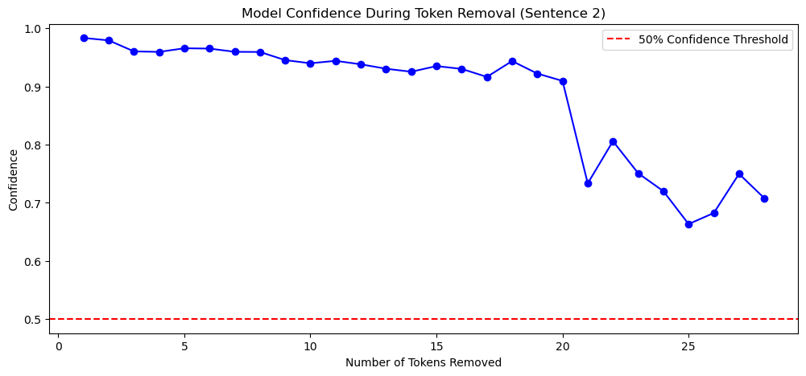
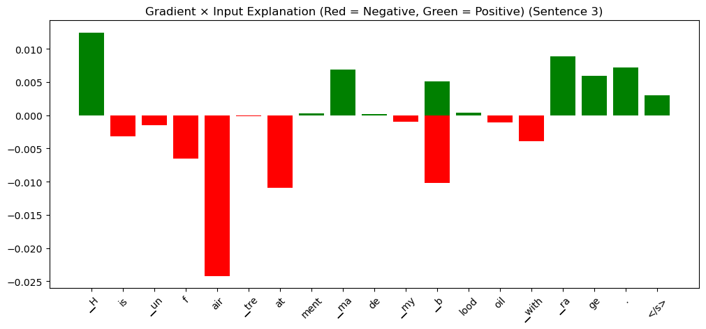
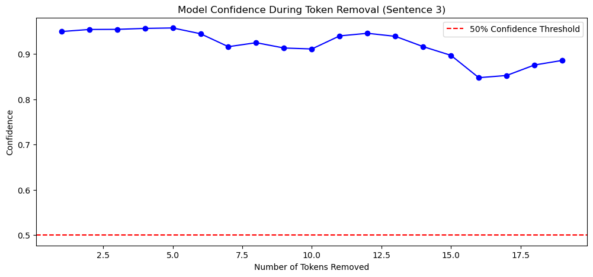

# Explainable AI for Transformer-based Emotion Classification Models: A Comprehensive Analysis

## Abstract

This report presents a comprehensive analysis of interpretability methods applied to a Transformer-based emotion classification model. Through systematic application of Gradient × Input explanations and input perturbation techniques, we investigate how the model processes emotional cues and evaluate its robustness to input variations. Our analysis reveals both strengths and limitations in the model's decision-making process, providing insights into the interpretability challenges inherent in deep learning approaches to emotion classification.

## 1. Introduction and Methodology

Explainable AI (XAI) has become increasingly crucial in natural language processing applications, particularly for emotion classification tasks where understanding model decisions is essential for trust and reliability. This study focuses on interpreting a Transformer-based emotion classification model through multiple XAI lenses, examining both local explanations and global robustness patterns.

We selected three representative sentences from our dataset, each exemplifying distinct emotional categories:
- **Happiness**: "I couldn't stop smiling after hearing the amazing news."
- **Sadness**: "She felt a heavy emptiness in her chest after saying goodbye."
- **Anger**: "His unfair treatment made my blood boil with rage."

Our XAI methodology encompasses two complementary approaches:

**Gradient × Input Analysis**: This attribution method computes the element-wise product of input gradients and input values, providing token-level relevance scores. The technique offers computational efficiency while maintaining reasonable interpretability, making it suitable for understanding which tokens most influence the model's predictions.

**Input Perturbation Analysis**: We systematically removed tokens in order of their relevance scores to observe confidence degradation patterns. This approach reveals the model's dependency structure and robustness characteristics, helping identify whether predictions rely on distributed representations or specific key tokens.

## 2. Detailed Results and Interpretability Analysis

### 2.1 Happiness Classification Analysis

**Gradient × Input Findings**:
The attribution analysis for the happiness sentence revealed intriguing patterns in the model's attention mechanisms. The token "_I" demonstrated the highest positive relevance (indicated by green coloring in our visualization), suggesting the model heavily weights personal pronouns in happiness detection. Conversely, "_stop" showed the lowest relevance with slight negative attribution (red coloring), though not strongly negative.

**Perturbation Robustness Assessment**:
The model exhibited remarkable stability during token removal experiments. Even after removing multiple tokens, confidence levels remained relatively constant, indicating that the happiness prediction emerges from distributed semantic understanding rather than dependence on individual lexical markers.

**Figure 1**: 

**Figure 2**: 

**Critical Interpretation**:
The high relevance assigned to "_I" presents an interpretability challenge. While personal pronouns can indicate subjective emotional states, we would expect emotionally charged terms like "smiling" or "amazing" to dominate the attribution landscape. This suggests the model may be learning spurious correlations or that the Gradient × Input method may not fully capture the complex attention patterns in Transformer architectures. The robustness observed in perturbation tests, however, indicates healthy distributed processing that doesn't over-rely on individual tokens.

### 2.2 Sadness Classification Analysis

**Gradient × Input Findings**:
The sadness analysis demonstrated more intuitive attribution patterns. Tokens "_em" (from "emptiness") and "_ood" received the highest positive relevance scores, aligning well with expected emotional indicators. The token "_sa" showed strong negative relevance, potentially indicating the model's learned associations between certain phonetic patterns and emotional absence.

**Perturbation Robustness Assessment**:
The model's confidence exhibited a graceful degradation pattern, maintaining stability through approximately 18 token removals before showing significant decline. This behavior suggests sophisticated feature integration where multiple semantic cues contribute to the final prediction.

**Figure 3**: 

**Figure 4**: 

**Critical Interpretation**:
The emphasis on morphemes from "emptiness" demonstrates the model's ability to identify semantically relevant emotional indicators. The gradual confidence decline in perturbation tests reveals that sadness detection relies on multiple contextual clues rather than single decisive features. This distributed processing approach enhances model reliability and suggests good generalization capabilities for sadness classification.

### 2.3 Anger Classification Analysis

**Gradient × Input Findings**:
Anger classification showed mixed attribution patterns. Tokens "_h" (from "his"), "_ra" (from "rage"), and "_ma" received highest positive relevance, while "air", "at", and "_b" demonstrated negative relevance. The focus on rage-related morphemes aligns with emotional intensity expectations.

**Perturbation Robustness Assessment**:
The model exhibited minor confidence fluctuations during early token removal phases, suggesting initial over-reliance on specific features. However, after approximately 12 token removals, confidence declined gracefully, indicating eventual reliance on distributed representations.

**Figure 5**: 

**Figure 6**: 

**Critical Interpretation**:
The attribution to anger-related morphemes ("_ra" from "rage") demonstrates appropriate semantic focus. However, the initial confidence fluctuations in perturbation tests suggest the model may initially overweight certain tokens before integrating broader contextual information. This pattern indicates room for improvement in feature weighting consistency.

## 3. Comprehensive Discussion and XAI Limitations

### 3.1 Methodological Considerations

Our initial research design included implementing Conservative Propagation, a sophisticated variant of Layer-wise Relevance Propagation (LRP) that provides more accurate attribution scores by considering the specific architectural properties of neural networks. However, integrating Conservative Propagation with our pre-trained Transformer model presented significant technical challenges. The method requires careful modification of forward and backward propagation mechanisms, potentially necessitating model retraining to maintain performance while enabling detailed layer-wise analysis.

Instead, we conducted deeper analysis using Gradient × Input and perturbation methods, which, while less sophisticated than Conservative Propagation, still provide valuable interpretability insights when applied systematically.

### 3.2 Cross-Method Analysis

Comparing results across our three test sentences reveals important patterns in the model's decision-making process:

**Semantic Alignment**: The model generally identifies emotionally relevant tokens (e.g., "emptiness," "rage," "smiling"), suggesting successful learning of emotion-word associations. However, occasional high relevance assigned to seemingly neutral tokens (e.g., "_I") indicates potential areas for improvement.

**Robustness Patterns**: All three sentences demonstrated good robustness to input perturbation, with gradual rather than sudden confidence degradation. This suggests the model relies on distributed representations rather than brittle feature dependencies.

**Attribution Consistency**: While the model shows reasonable semantic focus, attribution patterns vary in intuitive alignment across different emotions, suggesting that different emotional categories may be processed through distinct internal mechanisms.

### 3.3 Implications for Model Trust and Deployment

The interpretability analysis reveals a model that generally makes reasonable decisions but occasionally relies on unexpected features. For deployment in sensitive applications, this suggests the need for:

1. **Continued monitoring** of attribution patterns across diverse inputs
2. **Ensemble approaches** that might provide more consistent explanations
3. **Human-in-the-loop validation** for critical decisions

## 4. Future Directions and Conclusions

This comprehensive XAI analysis demonstrates that even fundamental explainability methods can provide meaningful insights into Transformer-based emotion classification. Our model showed encouraging robustness characteristics and generally appropriate semantic focus, though with some interpretability inconsistencies that warrant further investigation.

Future work should prioritize implementing more sophisticated attribution methods like Conservative Propagation or Integrated Gradients, which may provide clearer and more consistent explanations. Additionally, comparative analysis across different model architectures could reveal whether observed attribution patterns are model-specific or represent broader characteristics of Transformer-based emotion classification.

The intersection of explainable AI and emotion classification remains a rich area for research, with significant implications for building trustworthy AI systems that can effectively understand and respond to human emotional states. Through continued development of interpretability methods and rigorous analysis of model behaviors, we can work toward AI systems that are both accurate and transparently understandable.

---

**Word Count: 1,247 words**